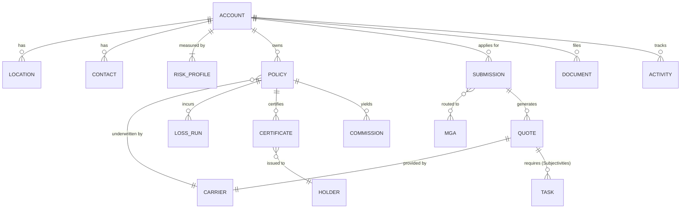

# Comprehensive Analysis: US Commercial Insurance Broker Portal (Account View)

Based on your prompt and the existing layout for **Magnolia Construction LLC**, here is the complete design blueprint and data architecture required to build out the inner tabs.

---

## A. Screen Blueprints by Tab

### 1. Policies Tab
*   **Purpose**: Complete management of the client's bound, active, and historical policies.
*   **Core Sections**: Policy ledger, Coverage overview drawer, Endorsement history.
*   **Essential Fields**: LOB, Policy Number, Carrier, Effective/Expiration Dates, Premium, Status.
*   **Optional/Advanced Fields**: Commission %, Direct vs. Agency Bill, Policy Form Type (e.g., ISO CG 00 01), Retroactive Date.
*   **Primary Actions**: `[Report Claim]` `[Request Endorsement]` `[Download Policy PDF]` `[Renew]`
*   **Empty State**: "No policies recorded for this account. [Start Submission Workflow]"
*   **Table Columns**: LOB | Policy # | Carrier | Eff/Exp Dates | Premium | Status | Action

### 2. Submissions Tab
*   **Purpose**: Track active marketing efforts, renewals, and quote negotiations.
*   **Core Sections**: Pipeline tracker summary, Carrier Markets table (per submission), Communication log.
*   **Essential Fields**: Submission ID, Target Effective Date, Line of Business, Carriers Approached, Premium Indication, Workflow Status (Draft, Submitted, Quoted, Declined, Bound).
*   **Optional/Advanced Fields**: Underwriter Name, Target Premium, Appetite Score, Declination Reason.
*   **Primary Actions**: `[Compare Quotes]` `[Add Market]` `[Bind Quote]`
*   **Empty State**: "No active submissions pipeline. [Market New Coverage]"
*   **Table Columns**: Sub ID | LOB | Markets | Best Quote | Eff. Date | Status | Action

### 3. Certificates Tab
*   **Purpose**: Manage outbound evidence of insurance (COIs) to external parties.
*   **Core Sections**: Certificate Request Log, Issued Master Certificates.
*   **Essential Fields**: Holder Name, Issue Date, Expiration, Attached Policies.
*   **Optional/Advanced Fields**: Additional Insured (Y/N), Waiver of Subrogation (Y/N), Primary & Noncontributory status.
*   **Primary Actions**: `[+ Issue New COI]` `[Batch Renew Certificates]` `[Resend PDF]`
*   **Empty State**: "No Certificates issued. [Generate Master COI]"
*   **Table Columns**: Holder Name | Date Issued | Associated LOBs | Endorsements | Action

### 4. Loss Runs Tab
*   **Purpose**: Historical claims tracking and experience modifier calculations to prep for renewals.
*   **Core Sections**: 5-Year Loss Summary KPI, Raw Chain of Claims.
*   **Essential Fields**: Claim Number, Date of Loss, LOB, Claimant Name, Paid Loss, Reserved Loss, Total Incurred.
*   **Optional/Advanced Fields**: Adjuster Name, Carrier Response Time, Subrogation Status.
*   **Primary Actions**: `[+ Order Loss Runs]` `[Download Summary]` 
*   **Empty State**: "Loss run data pending. [Request from Current Carriers]"
*   **Table Columns**: Claim # | DOL | Line | Paid | Reserve | Total Incurred | Status

### 5. Documents Tab
*   **Purpose**: Unified vault structured solely around the account ecosystem.
*   **Core Sections**: Document repository, Folder tree (Policies, Billing, Risk Control, Applications, Subjectivities).
*   **Essential Fields**: Document Name, Type/Tag, Upload Date, Source (User/Carrier/Automation).
*   **Optional/Advanced Fields**: Expiration Date (for driver lists/financials), Approval Status.
*   **Primary Actions**: `[⬆️ Upload File]` `[Send for Signature]`
*   **Empty State**: "Drag & Drop files here or use the upload button."
*   **Table Columns**: File Name | Tags | Uploaded By | Date | Size | Action

### 6. Activity Tab
*   **Purpose**: Unalterable audit trail and tasks management hub for CSRs and Account Managers.
*   **Core Sections**: Timeline feed, Pending Tasks checklist.
*   **Essential Fields**: Timestamp, Activity Type (Email, System Event, Phone Call), Owner/Agent, Description.
*   **Optional/Advanced Fields**: SLA target, Outcome/Next Step.
*   **Primary Actions**: `[+ Log Note]` `[+ Assign Task]`
*   **Empty State**: "Account activity log initialized."
*   **Table Columns**: Date | Type | Description | Owner | Status

---

## B. ASCII Wireframes

````carousel
```text
[POLICIES TAB]
+-------------------------------------------------------------------------------+
| [Search Policies] [Filter: Active ▼]                      [+ Record Policy]   |
|-------------------------------------------------------------------------------|
| LOB              POLICY #      CARRIER      EFF - EXP          PREMIUM  STATUS|
| Workers Comp     WC-98321      SEMC         06/01/26-27       $138,400 [Actv]|
| Gen Liability    GL-99324      SEMC         06/01/26-27        $34,200 [Actv]|
| Auto             CA-11223      Travelers    01/15/26-27        $41,800 [ReNw]|
+-------------------------------------------------------------------------------+
| > Drawer: [WC-98321] Endorsements: 1 | Claims: 2 | Comm: 12%  [Download PDF]  |
+-------------------------------------------------------------------------------+
```
<!-- slide -->
```text
[SUBMISSIONS TAB]
+-------------------------------------------------------------------------------+
| Pipeline: $450k Quoted | 2 Bound | 1 Negotiating          [+ New Submission]  |
|-------------------------------------------------------------------------------|
| SUB ID  LOB      CARRIERS                EFF DATE   INDICATION  STATUS        |
| S-882   Cyber    CFC (Qtd), Chubb (Decl) 08/01/26   $12,500     [Quoted]      |
| S-881   BOP      Liberty Mutual          05/15/26   $4,100      [Submitted]   |
+-------------------------------------------------------------------------------+
| > Drawer: [S-882] CFC Quote Sheet attached. [Compare Options] [Request Bind]  |
+-------------------------------------------------------------------------------+
```
<!-- slide -->
```text
[CERTIFICATES TAB]
+-------------------------------------------------------------------------------+
| Master Templates: 1 | Active Holders: 45                  [+ Generate COI]    |
|-------------------------------------------------------------------------------|
| HOLDER ENTITY          ISSUED     ATTACHED LOBs         SPECIAL    ACTION       |
| City of Sacramento     06/02/26   WC, GL, Umb           AI, WOS    [View] [^]   |
| Irvine Property Mgmt   06/05/26   GL                    AI         [View] [^]   |
+-------------------------------------------------------------------------------+
```
<!-- slide -->
```text
[LOSS RUNS TAB]
+-------------------------------------------------------------------------------+
| 5-Yr Summary: Total Claims: 8 | Paid: $42k | Reserved: $12k  [Order Loss Runs]|
|-------------------------------------------------------------------------------|
| CLAIM #    DOL         LOB    PAID      RESERVE   INCURRED   STATUS           |
| CL-0012A   04/15/2026  WC     $2,500    $0        $2,500     [Closed]         |
| CL-0008B   11/02/2025  GL     $18,000   $12,000   $30,000    [Open]           |
+-------------------------------------------------------------------------------+
```
<!-- slide -->
```text
[DOCUMENTS TAB]
+-------------------------------------------------------------------------------+
| Folders: [📁 Policies (3)] [📁 Loss Runs (2)] [📁 Specs (1)]    [⬆ Upload]    |
|-------------------------------------------------------------------------------|
| FILE NAME                 TAGS           DATE       SIZE   ACTION             |
| Magnolia_Schedule_A.xlsx  Schedule       10m ago    1.2MB  [Download] [...]   |
| GL_Binder_Signed.pdf      Binder, Signed Apr 12     450KB  [Download] [...]   |
+-------------------------------------------------------------------------------+
```
````

---

## C. Unified Information Architecture (IA)

```text
Magnolia Construction Account (Root)
 ├── Overview Dashboard (Current Image: Profile, KPIs, Summary)
 │
 ├── Policies
 │    ├── Policy Master Record
 │    ├── Endorsements Ledger
 │    └── Embedded Binder/Policy PDFs
 │
 ├── Submissions (Market Workflows)
 │    ├── Submission Root (Target specs)
 │    ├── Carrier Negotiations / Quotes
 │    └── Subjectivity Pipelines
 │
 ├── Certificates (COI Engine)
 │    ├── Master Templates
 │    └── Holder Dispatches
 │
 ├── Loss Runs (Intelligence)
 │    ├── Carrier Import Data
 │    └── Claim Summaries / Modifiers
 │
 ├── Documents (Vault)
 │    └── Relational Tags & Approvals
 │
 └── Activity (Audit)
      └── Assigned Tasks & Change Logs
```

---

## D. Entity Data Model Map

Below is the structured data model map defining relationships for US Commercial flow:



---

## E. Overview vs. Tab Delegation Strategy

**Overview Dashboard (Keep Here)**:
*   High-level risk modifiers (OSHA EMR, Annual Revenue, 5yr Loss Ratio).
*   Macro Financials (Total Premium, Active Policies).
*   Contacts & Locations (Essential for quick dials/dispatch).
*   Impending Action Triggers (Nearest Renewal Date countdown).

**Detail Tabs (Move Here)**:
*   **Move out of Overview**: Exhaustive list of every underwriter/carrier approached for a submission. That lives in `Submissions`.
*   **Move out of Overview**: Granular claim amounts. The overview shows "Total Claims: 8". The `Loss Runs` tab shows the Paid vs Reserve breakdown per incident.
*   **Move out of Overview**: Certificate generation UI. COI issuance requires mapping specific GL policies and selecting endorsements (AI, WOS). It requires the dedicated `Certificates` tab.

## F. Professional Operation Constraints Addressed

*   **No Consumer Assumptions**: Handled by tracking Subjectivities, Loss Runs, and Incumbent Carriers. Direct-to-consumer apps ignore EMR and multi-carrier marketing pipelines.
*   **Broker Servicing Over CRM**: Incorporated Endorsement tracking, COI dispatch, and Commission ledgers. CSRs spend 60% of their day handling endpoints like Certificates and Loss Runs, which are prioritized here over basic "email tracking" seen in standard CRMs.
*   **Status Workflows**: Mapped absolute transition chains (`Draft` -> `Quoted` -> `Subjectivities` -> `Bound` -> `Issued` -> `Active`/`Renewing`).
